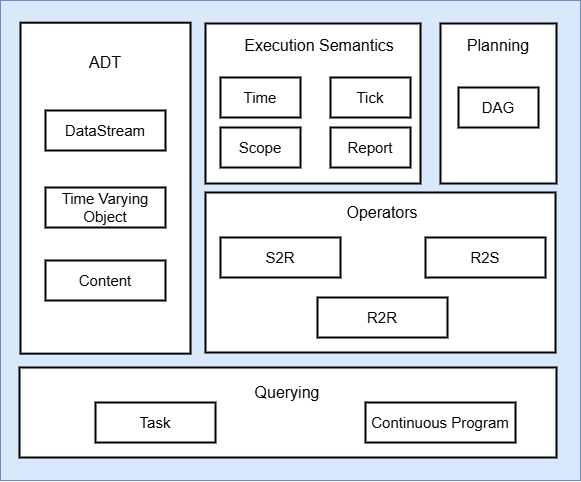
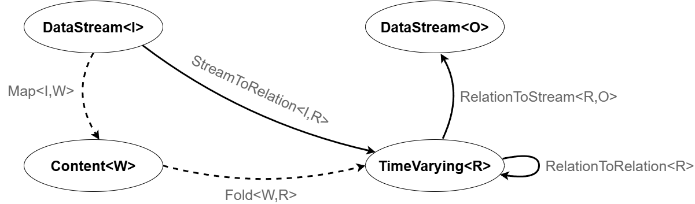

# Polyflow: A Framework to prototype Continuous Query Processors

Polyflow is a framework developed to efficiently prototype Continuous Query Processors (i.e. DSMSs execution engines).
It uses abstractions from both [CQL](https://dl.acm.org/doi/10.1007/s00778-004-0147-z) and [SECRET](https://dl.acm.org/doi/10.14778/1920841.1920874) to grant control over the process of Continuous Querying.

## Architecture

## Computation model

## Repositories
The Polyflow project consists of three repositories:
- [Polyflow](https://github.com/riccardotommasini/polyflow), which contains the APIs and some generic implementations of various operators (e.g., windows).
It does not contain any executable code.
- [Examples](https://github.com/riccardotommasini/polyflow-examples/), which contains numerous runnable examples using multiple data models (relational, graphs, documents). 
- [Quickstart](https://github.com/riccardotommasini/polyflow-quickstart), which is a step by step guide to get started with Polyflow and its abstractions. We suggest to start from here
before checking out the Examples repo.
